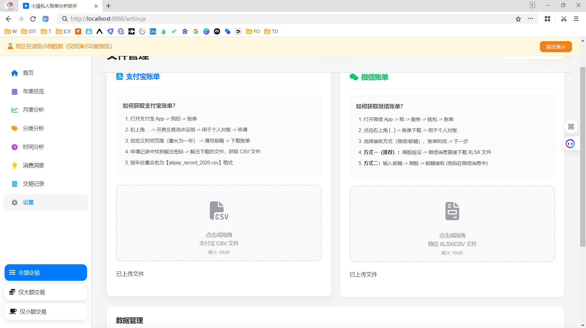
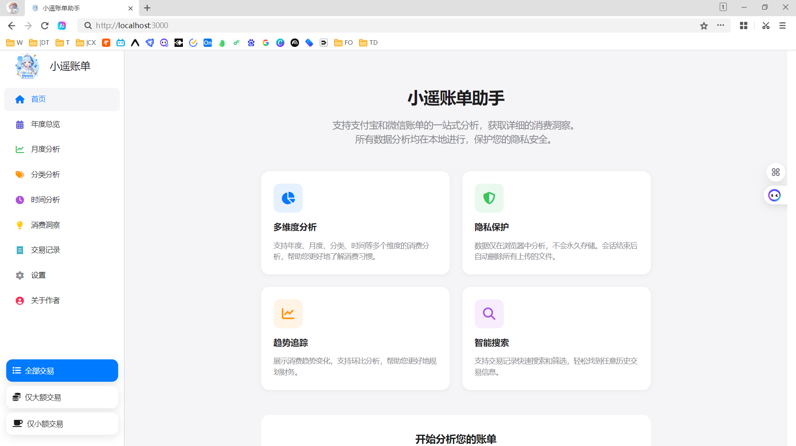
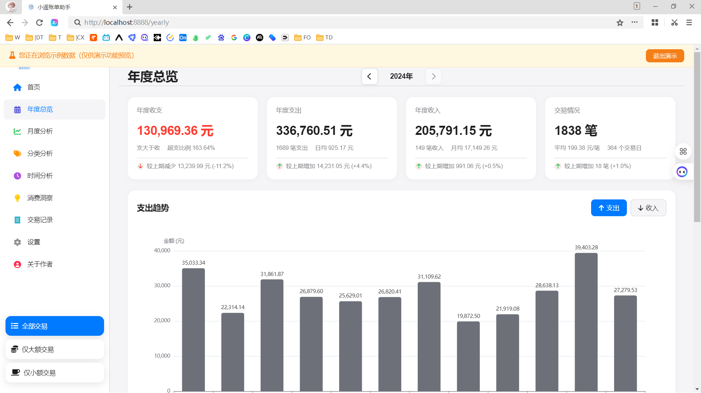
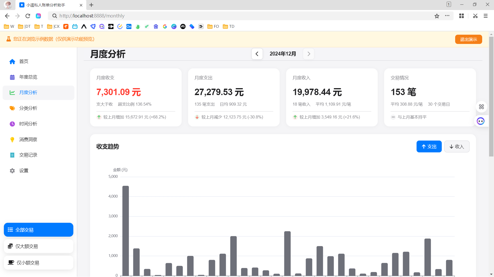
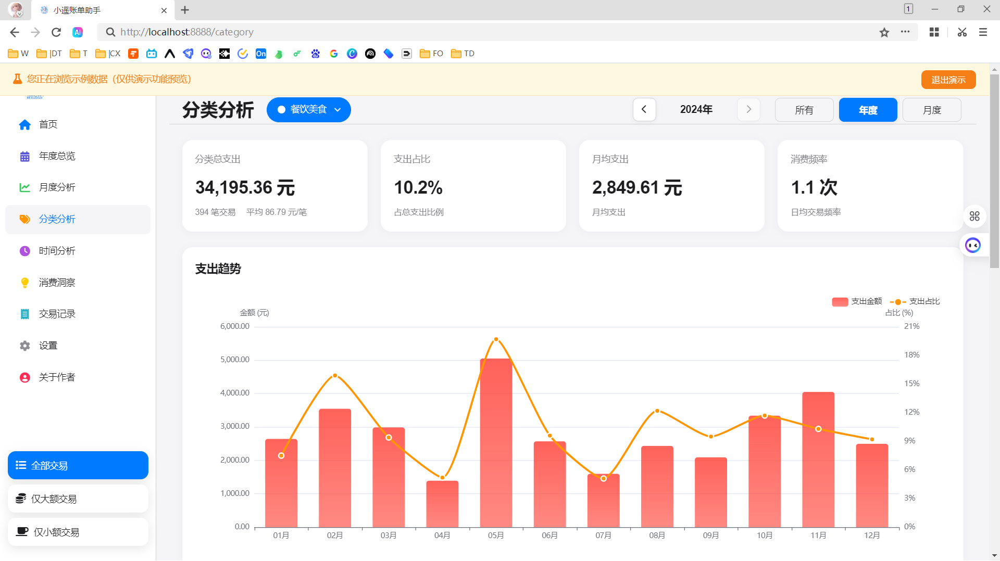
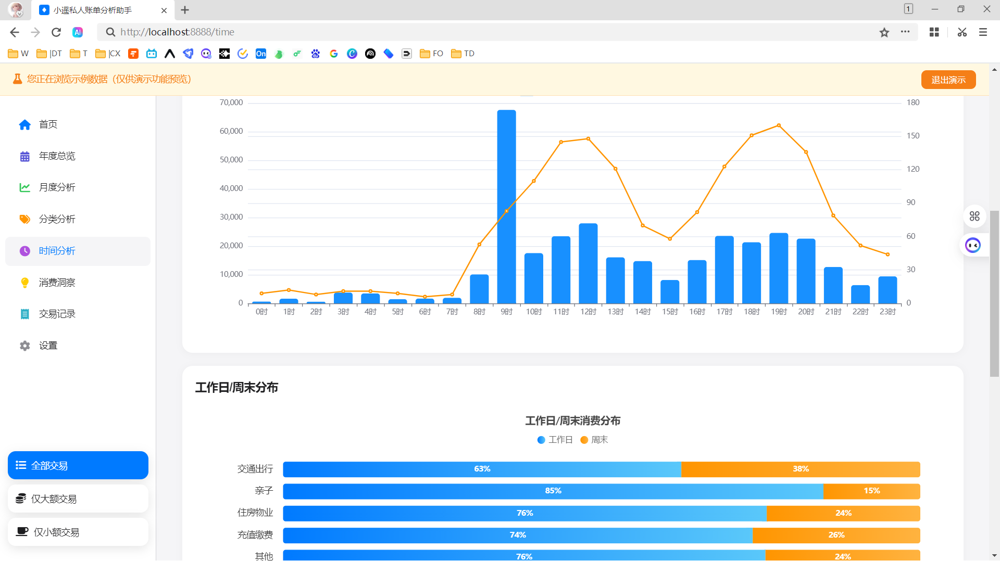
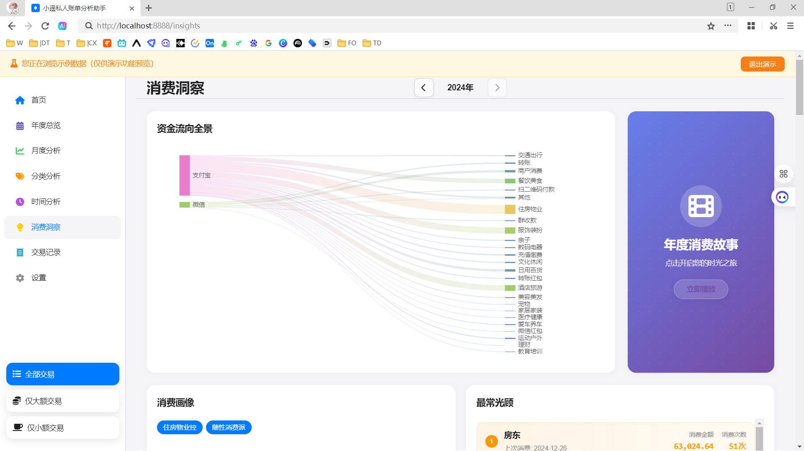
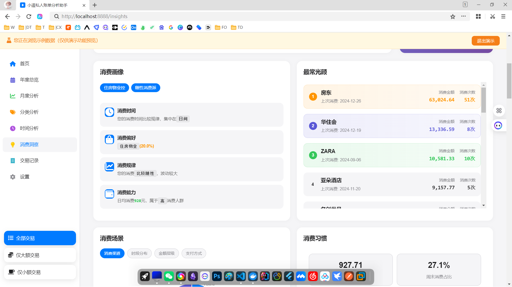
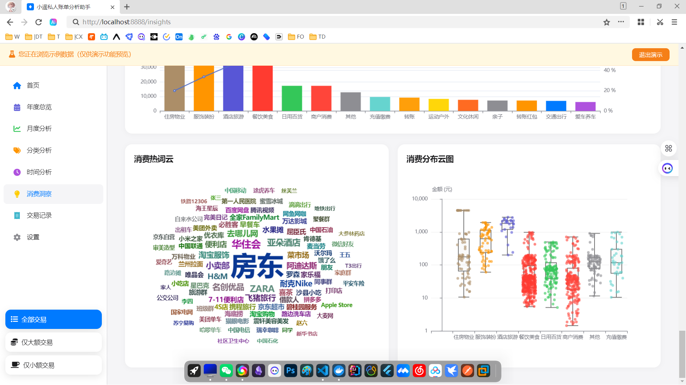
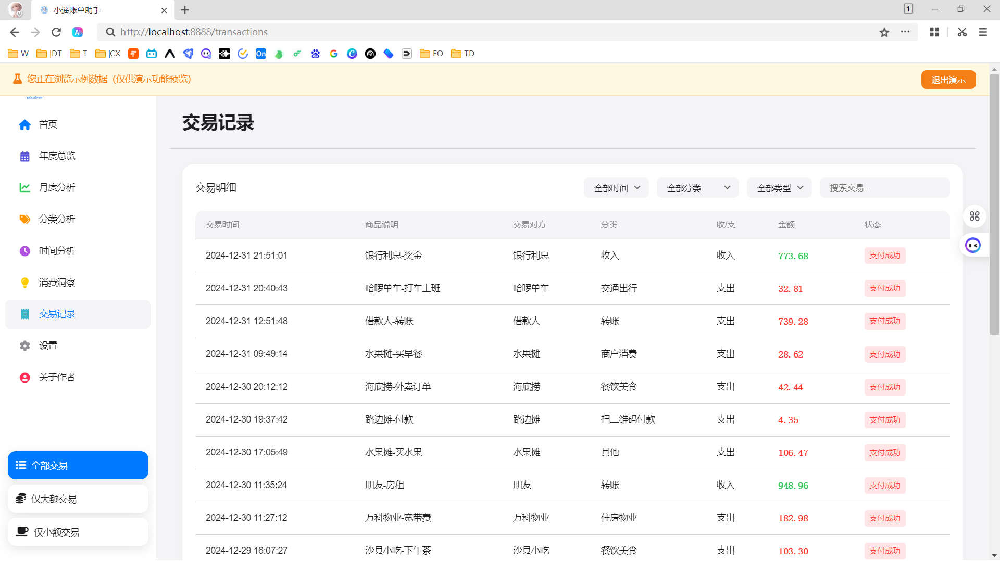

# 小遥账单助手

> 隐私优先的个人账单分析工具，数据完全本地处理，不上传任何服务器

[](https://opensource.org/licenses/MIT)
[](https://www.python.org/)
[](https://vuejs.org/)
[](https://www.docker.com/)

[English](README_EN.md) | 简体中文

---

## 简介

小遥账单助手是一个**隐私优先**的个人账单分析工具，支持支付宝和微信账单的自动解析和多维度数据可视化分析。

**核心特点**：
- 🔒 **隐私安全** - 数据完全本地处理，不上传任何服务器
- ⏰ **自动销毁** - 账单数据90分钟后自动销毁，无需手动清理
- 📊 **多维度分析** - 年度、月度、分类、时间、消费洞察
- 📁 **多格式支持** - 支付宝 CSV、微信 CSV/XLSX 账单文件
- 🚀 **快速部署** - Docker 一键启动，开箱即用
- 💻 **前后端分离** - Vue 3 + Flask 架构，易于维护扩展
- 📱 **响应式设计** - 支持桌面端和移动端访问

---

## 作者介绍

<p align="center">
  
</p>

<p align="center">
  <b>dtsola</b> — IT解决方案架构师 | 一人公司实践者
</p>

<p align="center">
  🌐 <a href="https://www.dtsola.com">个人站点</a> &nbsp;|&nbsp;
  📺 <a href="https://space.bilibili.com/736015">B站</a> &nbsp;|&nbsp;
  💬 微信：dtsola（与我建联，备注：github）
</p>

<p align="center">
  
</p>

---

## 功能预览

### 上传账单 - 一键导入

<table>
<tr>
<td width="50%"></td>
<td width="50%">
<ul>
<li>📤 支持拖拽上传账单文件</li>
<li>📋 自动识别支付宝/微信账单格式</li>
<li>⚡ 快速解析，一键生成分析报告</li>
</ul>
</td>
</tr>
</table>

### 首页 - 功能入口

<table>
<tr>
<td width="50%"></td>
<td width="50%">
<ul>
<li>🎯 全能账单分析工具 - 支持支付宝和微信账单</li>
<li>📊 4大功能卡片 - 多维度分析、隐私保护、趋势追踪、智能搜索</li>
<li>🚀 快捷操作 - 上传账单文件或查看示例数据</li>
</ul>
</td>
</tr>
</table>

### 年度总览 - 一目了然

<table>
<tr>
<td width="50%"></td>
<td width="50%">
<ul>
<li>📊 年度收支总览，收入支出清晰可见</li>
<li>📈 年度趋势图表，把握财务走向</li>
<li>📖 年度故事回顾，记录每一笔消费</li>
</ul>
</td>
</tr>
</table>

### 月度分析 - 精细对比

<table>
<tr>
<td width="50%"></td>
<td width="50%">
<ul>
<li>📅 月度收支趋势，环比同比分析</li>
<li>🗓️ 月度日历视图，每日消费一目了然</li>
<li>📉 月度对比分析，发现消费规律</li>
</ul>
</td>
</tr>
</table>

### 分类分析 - 花费明细

<table>
<tr>
<td width="50%"></td>
<td width="50%">
<ul>
<li>🏷️ 分类占比分析，钱花在哪一看便知</li>
<li>📊 分类排行统计，找出主要支出</li>
<li>📝 分类明细列表，逐笔查看记录</li>
</ul>
</td>
</tr>
</table>

### 时间分析 - 消费规律

<table>
<tr>
<td width="50%"></td>
<td width="50%">
<ul>
<li>⏰ 消费时间分布，了解消费时段</li>
<li>🌡️ 消费时段热力图，发现消费习惯</li>
<li>📈 消费趋势洞察，优化消费结构</li>
</ul>
</td>
</tr>
</table>

### 消费洞察 - 智能分析

<table>
<tr>
<td width="50%"></td>
<td width="50%"></td>
</tr>
<tr>
<td width="50%"></td>
<td width="50%">
<ul>
<li>💡 消费习惯分析，发现省钱机会</li>
<li>🔍 异常消费提醒，避免不必要支出</li>
<li>📊 消费建议，优化财务规划</li>
</ul>
</td>
</tr>
</table>

### 交易记录 - 明细查询

<table>
<tr>
<td width="50%"></td>
<td width="50%">
<ul>
<li>📋 完整交易明细，每一笔都清晰</li>
<li>🔍 多维度筛选，快速找到目标</li>
<li>📤 支持导出，方便进一步分析</li>
</ul>
</td>
</tr>
</table>

---

## 快速开始

### 方式一：Docker 一键安装（推荐给普通用户）

#### 环境准备

安装 Docker Desktop（已包含 Docker Compose）：
- Windows：https://docs.docker.com/desktop/setup/install/windows-install/
- Mac：https://docs.docker.com/desktop/setup/install/mac-install/
- Linux：https://docs.docker.com/desktop/setup/install/linux/

#### 启动步骤

```bash
# 1. 克隆项目
git clone https://github.com/dtsola/xiaoyaoprivatebill.git
cd xiaoyaoprivatebill

# 2. 一键启动
docker-compose up -d

# 3. 访问应用
# 浏览器打开: http://localhost:8888
```

#### 常用命令

```bash
# 查看日志
docker-compose logs -f

# 停止服务
docker-compose down

# 重启服务
docker-compose restart
```

---

### 方式二：开发者本地开发

#### 前置要求

- Python 3.10+
- Node.js 18+
- Git

#### 后端设置

```bash
# 1. 进入后端目录
cd backend

# 2. 创建并激活虚拟环境（Windows）
py -3.10 -m venv venv
venv\Scripts\activate

# 3. 安装依赖
pip install -r requirements.txt

# 4. 启动后端服务
python app.py
# 后端运行在: http://localhost:5000
```

#### 前端设置

```bash
# 1. 进入前端目录（新终端窗口）
cd frontend

# 2. 安装依赖
npm install

# 3. 启动开发服务器
npm run dev
# 前端运行在: http://localhost:3000
```

#### 开发模式命令

```bash
# 前端构建生产版本
npm run build

# 预览生产构建
npm run preview

# 后端退出虚拟环境
deactivate
```

---

## 使用说明

### 1. 获取账单文件

**支付宝账单**：
1. 打开支付宝 APP → 账单
2. 点击右上角「常见问题」→ 导出账单
3. 选择「个人账单」→ 时间范围 → 选中 CSV 格式
4. 输入邮箱，等待接收账单文件

**微信账单**：
1. 打开微信 APP → 我 → 服务 → 钱包 → 右上角「账单」
2. 点击「常见问题」→ 下载账单
3. 选择时间范围 → 输入邮箱 → 选择 CSV/XLSX 格式

### 2. 上传分析

1. 访问应用首页
2. 点击「上传账单」按钮
3. 选择下载好的账单文件（CSV/XLSX）
4. 等待解析完成，自动跳转到分析页面

### 3. 数据导出

分析完成后，可以将结果导出为：
- PNG 图片（图表截图）
- CSV 数据（原始数据）

---

## 技术栈

### 后端

| 技术 | 版本 | 说明 |
|------|------|------|
| Python | 3.10+ | 后端开发语言 |
| Flask | 2.0+ | Web 框架 |
| Pandas | Latest | 数据处理核心 |
| NumPy | Latest | 数值计算 |
| OpenPyXL | Latest | Excel 文件处理 |

### 前端

| 技术 | 版本 | 说明 |
|------|------|------|
| Vue | 3.4+ | 前端框架 |
| Vite | 5.0+ | 构建工具 |
| Vue Router | 4.2+ | 路由管理 |
| Pinia | 2.1+ | 状态管理 |
| ECharts | 5.4+ | 数据可视化 |

### 部署

| 技术 | 说明 |
|------|------|
| Docker | 容器化部署 |
| Docker Compose | 服务编排 |
| Nginx | Web 服务器 |

---

## 项目结构

```
xiaoyaoprivatebill/
├── backend/               # 后端项目（Flask + Pandas）
│   ├── api/              # API 路由层
│   ├── services/         # 业务逻辑层
│   ├── parsers/          # 文件解析模块
│   ├── utils/            # 工具函数
│   ├── data/             # 临时数据目录
│   ├── app.py            # 应用入口
│   ├── config.py         # 配置管理
│   ├── Dockerfile        # 后端镜像构建
│   └── requirements.txt  # Python 依赖
│
├── frontend/             # 前端项目（Vue 3 + Vite）
│   ├── src/
│   │   ├── api/         # API 客户端
│   │   ├── views/       # 页面组件
│   │   ├── components/  # 公共组件
│   │   ├── stores/      # 状态管理（Pinia）
│   │   └── utils/       # 工具函数
│   ├── nginx.conf       # Nginx 配置
│   ├── Dockerfile       # 前端镜像构建
│   ├── package.json     # 依赖配置
│   └── vite.config.js   # Vite 配置
│
├── docs/                 # 设计文档目录
├── docker-compose.yml    # Docker 编排配置
└── README.md            # 本文档
```

---

## 文档

- [市场需求文档 (MRD)](docs/00-mrd.md)
- [产品需求文档 (PRD)](docs/01-prd.md)
- [API 接口文档](docs/接口文档.md)
- [技术方案文档](docs/03-技术方案文档.md)
- [部署文档](docs/部署文档.md)
- [开发指南](docs/开发进度.md)

---

## 致谢

本项目的前端和后端完全重构自优秀开源项目 [alipay_record_analysis](https://github.com/Hessel2333/alipay_record_analysis)，感谢原作者 **Hessel2333** 提供的灵感和基础代码。

在原项目的基础上，本项目进行了以下改进：
- 前端从 Jinja2 模板重构为 Vue 3 + Vite 现代化架构
- 后端从单体应用重构为模块化蓝图架构
- 优化前端、后端性能
- 优化数据可视化展示
- 添加 Docker 一键部署能力

---

## 贡献指南

欢迎贡献代码、报告问题或提出建议！

### 开发流程

1. Fork 本仓库
2. 创建功能分支 (`git checkout -b feature/AmazingFeature`)
3. 提交更改 (`git commit -m 'feat: 添加某个功能'`)
4. 推送到分支 (`git push origin feature/AmazingFeature`)
5. 创建 Pull Request

### 代码规范

- 后端遵循 [PEP 8](https://pep8.org/) 规范
- 前端遵循 [ESLint](https://eslint.org/) 推荐规范
- 提交信息遵循 [Conventional Commits](https://www.conventionalcommits.org/) 规范

详细规范请参阅 [CLAUDE.md](.claude/CLAUDE.md)

---

## 常见问题

### Q: 支持哪些账单格式？

A: 目前支持：
- 支付宝 CSV 账单
- 微信 CSV 账单
- 微信 XLSX 账单

### Q: 数据会上传到服务器吗？

A: 不会。所有数据处理完全在本地进行，不上传任何服务器。

### Q: 支持移动端吗？

A: 支持。前端采用响应式设计，可在手机浏览器上正常使用。

### Q: 如何修改默认端口？

A:
- Docker 部署：修改 `docker-compose.yml` 中的端口映射
- 后端：修改 `backend/config.py` 中的 `PORT` 配置
- 前端开发：修改 `frontend/vite.config.js` 中的 `server.port` 配置

---

## 许可证

本项目采用 [MIT 许可证](LICENSE)

---

## 联系方式

- 项目主页: [GitHub](https://github.com/dtsola/xiaoyaoprivatebill)
- 问题反馈: [Issues](https://github.com/dtsola/xiaoyaoprivatebill/issues)

---

**Made with ❤️ by Xiaoyao Team**
