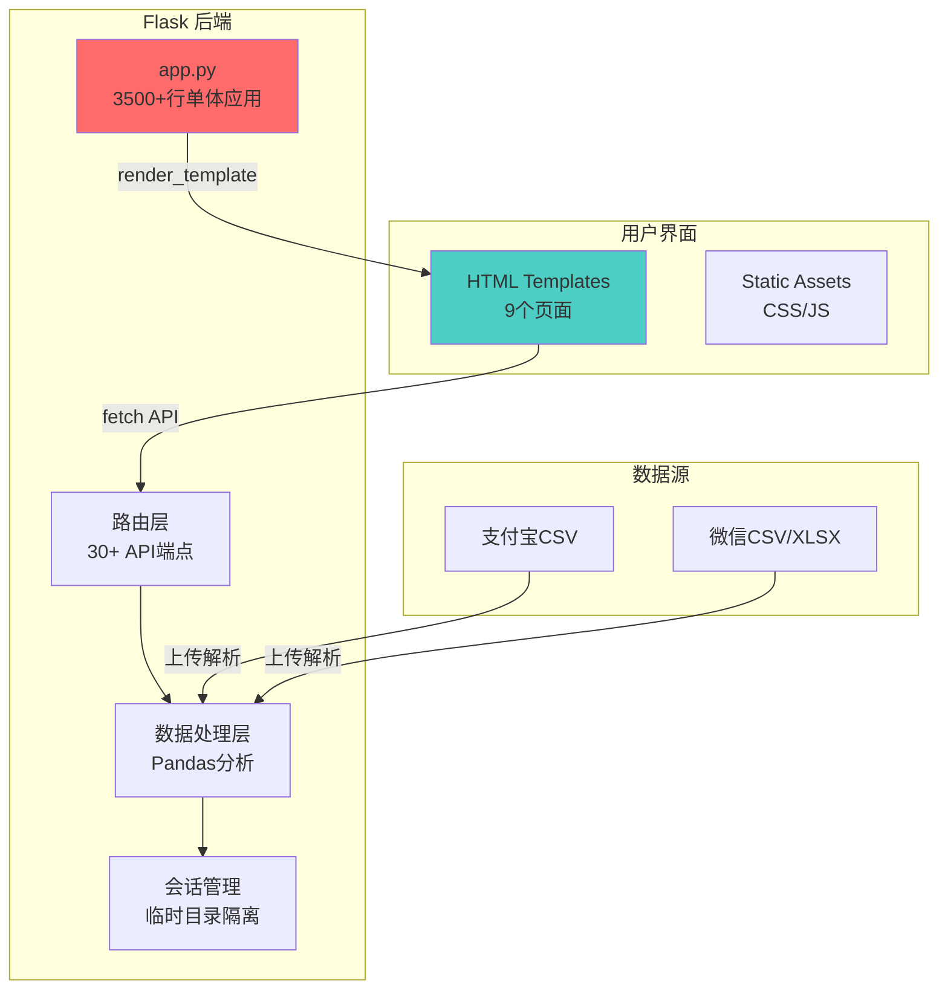
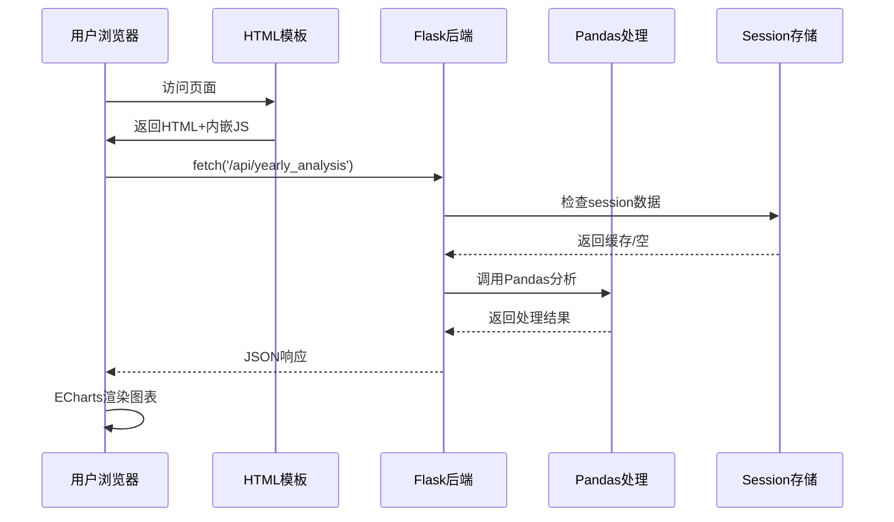

# 老账单项目分析 (olds Project Analysis)

## 1. 项目概述 (The Big Picture)

### 一句话描述
一个基于 Flask 的个人账单分析工具，支持支付宝和微信账单的上传、解析和多维度数据可视化分析。

### 技术栈

**后端:**
- Flask 2.0+ - Python Web 框架
- Pandas - 数据处理核心
- NumPy - 数值计算
- OpenPyXL - Excel 文件处理

**前端:**
- 原生 JavaScript (无框架)
- ECharts 5.4.3 - 数据可视化
- Apple Design System - UI 设计风格
- Font Awesome 6.5.1 - 图标库

### 架构图



## 2. 目录结构 (Map of the Territory)

```
olds/
├── app.py                 # 核心：3500+行单体应用
├── requirements.txt       # Python依赖
├── templates/            # 前端模板 (9个页面)
│   ├── base.html        # 基础模板
│   ├── index.html       # 首页/仪表板
│   ├── yearly.html      # 年度分析
│   ├── monthly.html     # 月度趋势
│   ├── category.html    # 分类分析
│   ├── time.html        # 时间分析
│   ├── insights.html    # 消费洞察
│   ├── transactions.html # 交易记录
│   └── settings.html    # 设置页
├── static/
│   ├── css/style.css    # Apple Design风格样式
│   └── js/utils.js      # 工具函数
├── scripts/             # 实用脚本
├── docs/               # 文档目录
└── Vide_coding_file/   # 开发笔记
```

## 3. 前后端强耦合分析

### 耦合点详解

#### 3.1 直接模板集成
- Flask 模板使用 `url_for()` 直接生成后端 URL
- 没有 API 抽象层
- 前端直接调用后端端点

#### 3.2 API 调用模式 (JavaScript → Python)

| 前端调用 | 后端路由 | 功能 |
|---------|---------|------|
| `fetch('/api/yearly_analysis')` | `@app.route('/api/yearly_analysis')` | 年度数据 |
| `fetch('/api/monthly_analysis')` | `@app.route('/api/monthly_analysis')` | 月度趋势 |
| `fetch('/api/category_expenses')` | `@app.route('/api/category_expenses')` | 分类分析 |
| `fetch('/api/transactions')` | `@app.route('/api/transactions')` | 交易记录 |
| `fetch('/api/insights')` | `@app.route('/api/insights')` | 消费洞察 |

#### 3.3 数据流模式



#### 3.4 代码重复问题

**分类颜色映射重复定义:**
```javascript
// 前端: static/js/utils.js
window.CATEGORY_COLORS = {
    '餐饮美食': '#FF3B30',
    '酒店旅游': '#5856D6',
    // ... 重复定义
}
```

后端同样定义了相同的颜色映射，没有共享。

#### 3.5 紧耦合特征总结

| 特征 | 表现 | 影响 |
|-----|------|-----|
| 单体应用 | 3500+行 app.py | 难以维护 |
| 无构建流程 | 直接服务静态文件 | 无优化/压缩 |
| 模板内嵌JS | 业务逻辑混在HTML中 | 代码混乱 |
| 硬编码API | JavaScript中硬编码端点 | 难以重构 |
| 会话状态 | 后端管理会话 | 前后端紧绑 |

## 4. 核心路径追踪

### 文件上传流程

```
用户上传文件
    ↓
app.py: /api/upload
    ↓
parse_alipay_csv() / parse_wechat_csv()
    ↓
pandas.read_csv() / read_excel()
    ↓
数据存储到 session 目录
    ↓
返回成功响应
```

### 年度分析流程

```
访问 /yearly 页面
    ↓
yearly.html 加载
    ↓
fetch('/api/yearly_analysis')
    ↓
app.py: yearly_analysis() 路由
    ↓
compute_yearly_summary() 函数
    ↓
pandas groupby + agg 操作
    ↓
返回 JSON { success: true, data: {...} }
    ↓
前端 updateCharts() 渲染 ECharts
```

## 5. 风险与债务 (Risks & Debt)

### 代码异味

1. **巨型单体文件**: `app.py` 3500+ 行
2. **硬编码值**: 分类颜色、格式化函数重复定义
3. **缺少测试**: 无测试文件
4. **无类型注解**: Python 函数缺少类型提示
5. **魔法数字**: 大量硬编码常量

### 架构债务

| 问题 | 严重性 | 说明 |
|-----|-------|------|
| 前后端紧耦合 | 高 | API变更需修改多处 |
| 无持久化存储 | 中 | 会话丢失数据消失 |
| 缺少错误处理 | 中 | 用户体验差 |
| 无构建流程 | 低 | 性能未优化 |

### 建议的首个重构任务

**推荐**: 抽取 API 客户端层
- 创建 `static/js/api.js` 统一管理 API 调用
- 定义 API 端点常量
- 封装 fetch 请求逻辑
- 统一错误处理

## 6. 关键文件清单

| 文件 | 行数 | 作用 |
|-----|------|-----|
| app.py | 3500+ | 核心应用 |
| templates/base.html | ~200 | 基础模板 |
| static/js/utils.js | ~100 | 工具函数 |
| static/css/style.css | ~800 | 样式定义 |

## 7. 启动命令

```bash
# 安装依赖
pip install -r requirements.txt

# 运行应用
python app.py

# 访问
http://localhost:8080
```

## 总结

这是一个典型的传统 Flask 应用，采用服务端渲染+ AJAX 模式。虽然功能完整，但前后端高度耦合，缺乏现代前端的工程化实践。适合作为学习项目，但如需扩展，建议进行架构重构。
