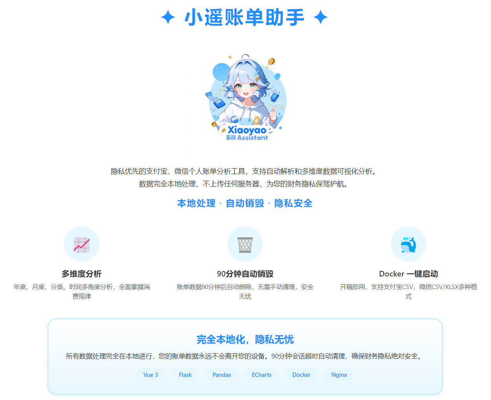

# 小遥账单助手 - 隐私优先的账单分析工具

  

---

## ✦ 核心亮点

### 🔒 绝对隐私
- **数据完全本地处理**，不上传任何服务器
- **90分钟自动销毁**，无需手动清理
- 财务隐私，尽在掌控

### 📊 功能强大
- **多维度分析**：年度、月度、分类、时间、消费洞察
- **支持格式**：支付宝 CSV、微信 CSV/XLSX
- **智能洞察**：自动分析消费习惯，发现省钱机会

### 🚀 极易使用
- **Docker 一键启动**，开箱即用
- **响应式设计**，支持桌面和移动端
- **拖拽上传**，自动识别，秒级解析

---

## 📸 功能展示

### 一键上传，自动识别

  

拖拽上传支付宝或微信账单文件，系统自动识别格式并解析。

### 年度总览

  

年度收支汇总、月度趋势、分类占比一目了然。

### 月度分析

  

按月查看收支明细，分析月度消费规律。

### 分类分析

  

按类别统计消费，了解钱都花在哪里。

### 时间分析

  

分析消费时间规律，发现消费习惯。

### 智能洞察

  

  

  

自动分析高频商户、大额消费、夜间消费等，发现省钱机会。

### 交易记录

  

完整的交易记录明细，支持搜索和分页。

---

## 🎯 适用人群

- 个人财务管理爱好者
- 注重隐私安全的用户
- 需要长期账单分析的人士
- 希望优化消费结构的人群

---

## 🛠 技术架构

- **前端**：Vue 3 + Vite + ECharts
- **后端**：Flask + Pandas
- **部署**：Docker + Nginx
- **开源协议**：MIT License（即将开源）

---

## 📝 联系作者

**dtsola** — IT解决方案架构师 | 一人公司实践者

- 🌐 个人站点：https://www.dtsola.com
- 📺 B站：https://space.bilibili.com/736015
- 💬 微信：dtsola（备注：小遥账单）

---

## 🔥 即将开源

项目即将在 GitHub 开源，敬请期待！

关注作者获取最新动态，第一时间体验完整功能。

---

**小遥账单助手 - 让每一分钱都清晰可见**
